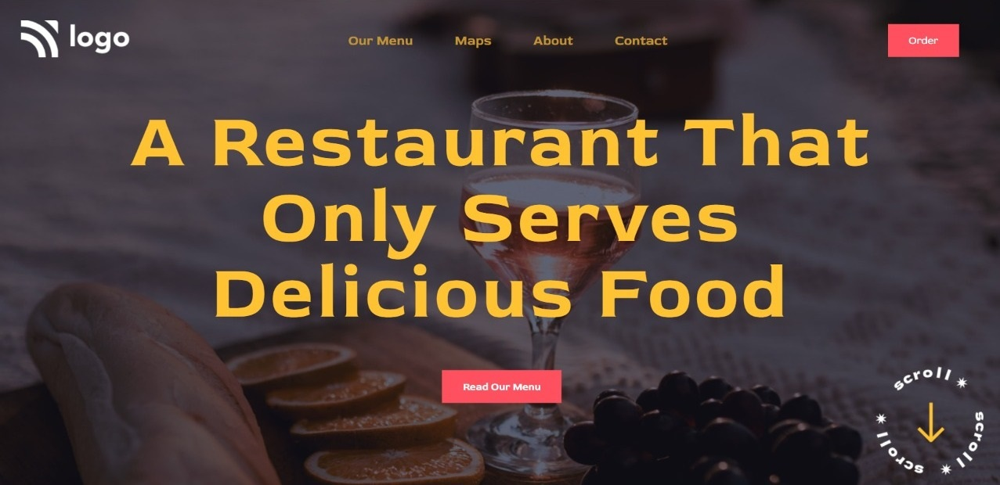

# Assignment-2 
## (Food Restaurant Home Page) 

> In this project, I have used HTML (the Hypertext Markup Language) and CSS (Cascading Style Sheets), which are two of the core technologies for building Web pages. It is a static and non-responsive page.

### As a result of this project, I learn the following:
[LIVE-LINK](https://food-resturant-home.netlify.app/)

- [x] positioning property in the HTML and CSS
- [x] How to insert Background properly
- [x] Use different font and linear gradient
- [x] learned about Basic Button Styling

#### The duration of the project:2hour